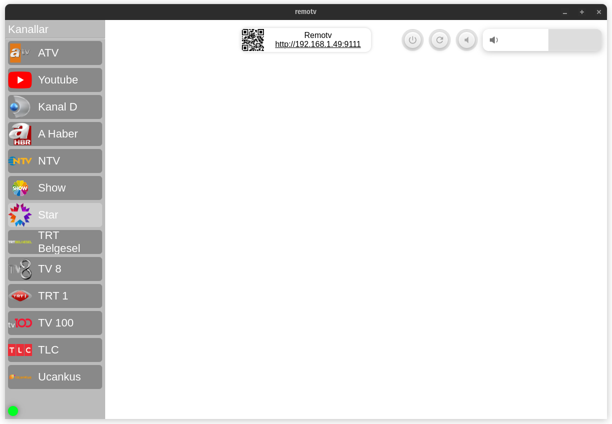
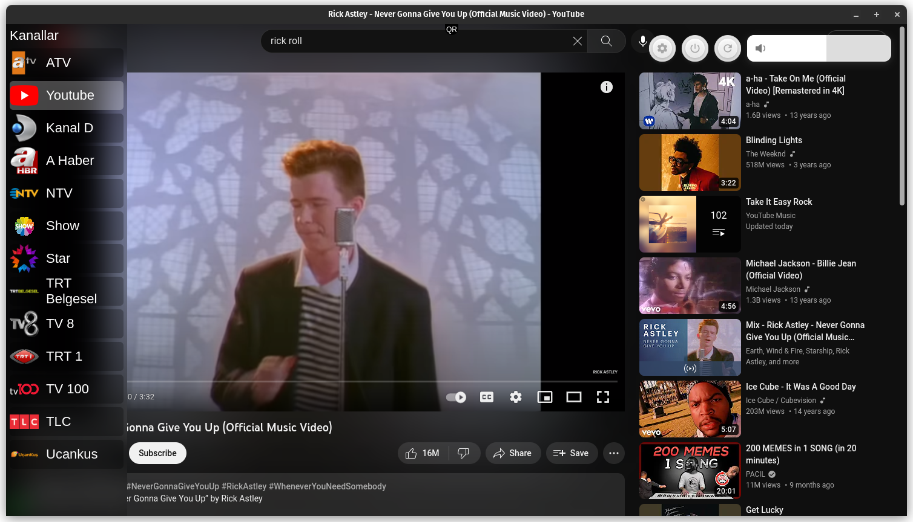
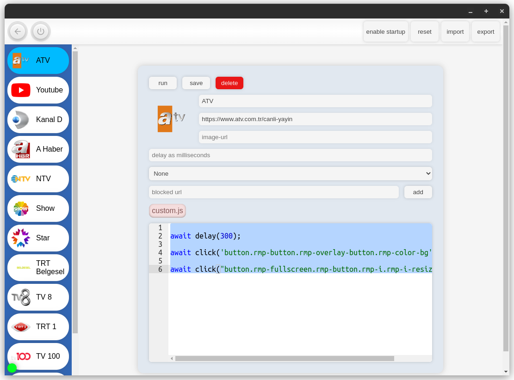
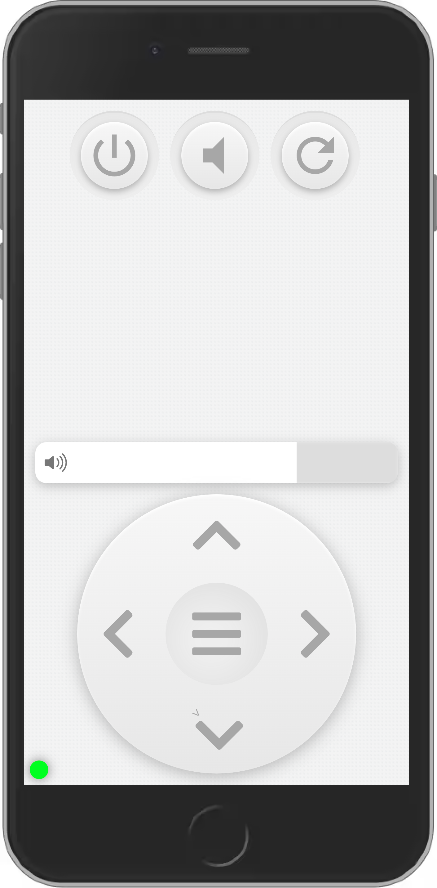
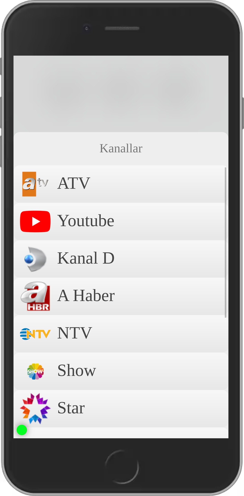

# Remotv

### Some kind of tv application with adblocking & remote control

* set your favourite stream channels
* change channel, adjust volume, shutdown etc with remote control which you access by scanning qr code
* mouse support & specialized ui
* channel-command import & export tool
* channel-command options, built in javascript editor


### Installation

#### Releases
who knows maybe you should find your release in  [releases](https://github.com/felbsn/remotv/releases) section.
 
#### Source

> please do not use pnpm, it causes problem with electron-builder

```console
git clone https://github.com/felbsn/remotv
cd remotv && npm i
npm run build
```

### Noticeable notable notes
1. applicaton uses single json as a db
    ```javascript 
        //electron/commands.mjs
        //so you should know internal data storage location...
        const userDataDir = app.getPath("userData")
        const commandsFilePath = `${userDataDir}/commands.json`
    ```
2. by default app uses port 9111 (for remote control service), if this is a problem you can specify any port with --port 2023 or -p 2000

3. actual app structure is much older and i am not proud of it. but it works and why not?


### Screens





### Remote UI
|  |  |
|-|-|
|||


